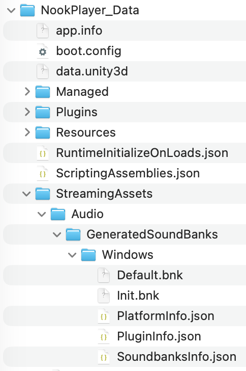
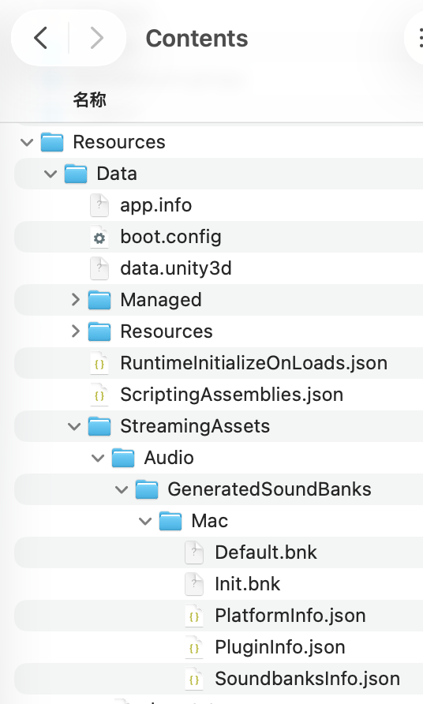

# Animal Crossing New Horizen Music Player

## 说明

根据你的IP地址，使用`api.weatherapi.com`来获取天气信息。如果打开以后获取到的天气信息不正确，请把这个API地址添加到代理的豁免列表里。

为了避免版权问题，本开源库不包含Audiokinetic以及Nintendo的资产。如果你需要完整使用这个项目，你需要使用Audiokinetic Launcher将Wwise Integration添加到Unity项目中，并将对应的音乐wav文件存放至Wwise工程的对应位置。

只做官方Nintendo Music没有提供的功能。

## 使用方法

### 仅生成Soundbank

1.  准备软件和素材

准备好动森全天24小时，三种天气的BGM共72首，按下列方式命名：
```
018 - 12 AM (Midnight).wav
019 - 1 AM.wav
020 - 2 AM.wav
021 - 3 AM.wav
022 - 4 AM.wav
023 - 5 AM.wav
024 - 6 AM.wav
025 - 7 AM.wav
026 - 8 AM.wav
027 - 9 AM.wav
028 - 10 AM.wav
029 - 11 AM.wav
030 - 12 PM (Noon).wav
031 - 1 PM.wav
032 - 2 PM.wav
033 - 3 PM.wav
034 - 4 PM.wav
035 - 5 PM.wav
036 - 6 PM.wav
037 - 7 PM.wav
038 - 8 PM.wav
039 - 9 PM.wav
040 - 10 PM.wav
041 - 11 PM.wav
042 - 12 AM (Midnight) - Rainy.wav
043 - 1 AM - Rainy.wav
044 - 2 AM - Rainy.wav
045 - 3 AM - Rainy.wav
046 - 4 AM - Rainy.wav
047 - 5 AM - Rainy.wav
048 - 6 AM - Rainy.wav
049 - 7 AM - Rainy.wav
050 - 8 AM - Rainy.wav
051 - 9 AM - Rainy.wav
052 - 10 AM - Rainy.wav
053 - 11 AM - Rainy.wav
054 - 12 PM (Noon) - Rainy.wav
055 - 1 PM - Rainy.wav
056 - 2 PM - Rainy.wav
057 - 3 PM - Rainy.wav
058 - 4 PM - Rainy.wav
059 - 5 PM - Rainy.wav
060 - 6 PM - Rainy.wav
061 - 7 PM - Rainy.wav
062 - 8 PM - Rainy.wav
063 - 9 PM - Rainy.wav
064 - 10 PM - Rainy.wav
065 - 11 PM - Rainy.wav
066 - 12 AM (Midnight) - Snowy.wav
067 - 1 AM - Snowy.wav
068 - 2 AM - Snowy.wav
069 - 3 AM - Snowy.wav
070 - 4 AM - Snowy.wav
071 - 5 AM - Snowy.wav
072 - 6 AM - Snowy.wav
073 - 7 AM - Snowy.wav
074 - 8 AM - Snowy.wav
075 - 9 AM - Snowy.wav
076 - 10 AM - Snowy.wav
077 - 11 AM - Snowy.wav
078 - 12 PM (Noon) - Snowy.wav
079 - 1 PM - Snowy.wav
080 - 2 PM - Snowy.wav
081 - 3 PM - Snowy.wav
082 - 4 PM - Snowy.wav
083 - 5 PM - Snowy.wav
084 - 6 PM - Snowy.wav
085 - 7 PM - Snowy.wav
086 - 8 PM - Snowy.wav
087 - 9 PM - Snowy.wav
088 - 10 PM - Snowy.wav
089 - 11 PM - Snowy.wav
```

2.  将重命名好的音频放入`ACPlayer_WwiseProject/Originals/SFX/`文件夹内。

3.  安装Wwise 2025.1.4并打开。Wwise的安装方法请参考[本文档](https://www.audiokinetic.com/zh/public-library/launcher_2025.3.3.5754/?source=InstallGuide&id=install_wwise_through_launcher)。

4.  按下Ctrl+shift+F7（Mac为⌘+shift+fn+F7)，开始生成soundbank。生成过程中可能会报错，是正常的。只需检查`ACPlayer_WwiseProject/GeneratedSoundbanks/`内对应平台有没有对应的`.bnk`文件即可。如果有一个名为`Defaul.bnk`的文件，且体积在150MB以上则为正常生成。

5.  拷贝生成的Soundbank文件至以下位置：
    #### Windows

    将`ACPlayer_WwiseProject/GeneratedSoundbanks/Windows`文件夹移动到
    `游戏目录\NookPlayer_data\StreamingAssets\Audio\GeneratedSoundbanks`。

    

    #### macOS

    在`NookPlayer.app`上右键或control+点击，选择“显示包内容”。
    将`ACPlayer_WwiseProject/GeneratedSoundbanks/Mac`文件夹移动到
    `NookPlayer.app/Contents/Resources/Data/StreamingAssets/Audio/GeneratedSoundbanks`内。
    
    
    
6. 启动软件。Windows上运行游戏目录下的`NookPlayer.exe`。Mac上双击运行`NookPlayer.app`。


### 自行编译完整内容

1.  准备软件和素材

-  动森BGM
-  Unity 6000.3.0f1
-  Wwise 2025.1.4

2.  安装环境

Unity的安装方法，请参考[本教程](https://unity.com/download)。

Wwise的安装方法请参考[本文档](https://www.audiokinetic.com/zh/public-library/launcher_2025.3.3.5754/?source=InstallGuide&id=install_wwise_through_launcher)，集成过程请参考[本文档](https://www.audiokinetic.com/zh/public-library/Launcher_2025.3.3.5754/?source=InstallGuide&id=integrating_wwise_into_a_unity_project)。

3.  导入素材

将准备好的动森BGM按以下名称放入`ACPlayer_WwiseProject/Originals/SFX/`文件夹内。

完成导入后，按Ctrl+shift+F7生成soundbank。可能会报错，是正常情况。

4.  生成可运行的编译后程序

打开Unity，根据你的运行平台进行编译。


## TODO

-  [x] 不同天气切换淡入淡出
-  [x] 音量滑块
-  [x] 跟随当前天气情况播放对应音乐
-  [x] 刷新按钮防爆破
-  [x] 整点切换效果优化
-  [x] 刷新过程中显示占位符
-  [x] 获取信息失败处理
-  [x] 发布前撰写使用指南
-  [x] 手动选择时间和天气
   -  [x] 非手动模式时隐藏选项
   -  [x] 点击应用后可以设置当前时间和状态至 GlobalService
   -  [x] 打开手动模式时，同步当前季节和时间
   -  [x] 应用当前时间和天气
   -  [x] 退出手动模式以后，无法回到自动天气状态的bug
   -  [x] 将等待时长恢复到由程序控制，而非在wwise内编辑

-  [ ] 移动端适配
-  [ ] 昼夜切换
-  [ ] 自定义岛屿主题曲
-  [ ] 节日播放对应音乐（新年除外）
-  [ ] 新年倒计时相关音乐
-  [ ] 各处地点音乐（博物馆除外）
-  [ ] 博物馆对应音乐
-  [ ] 缓存命中+IP地址判断
-  [ ] 天气切换淡变刷新脚本
-  [ ] 多语言

### 开发笔记
[这个](https://www.ip2location.io/)API好用，但是不知道为啥注册不上。先码了。

和风天气和心知天气的数据都很好。但是和风要JWT，心知也要搭服务器做私钥签名……

### Open Source Disclaimer

TimePicker - TTP
